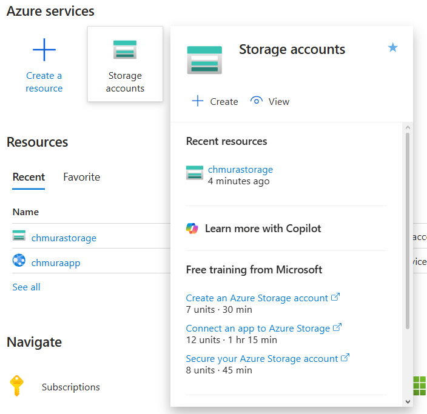
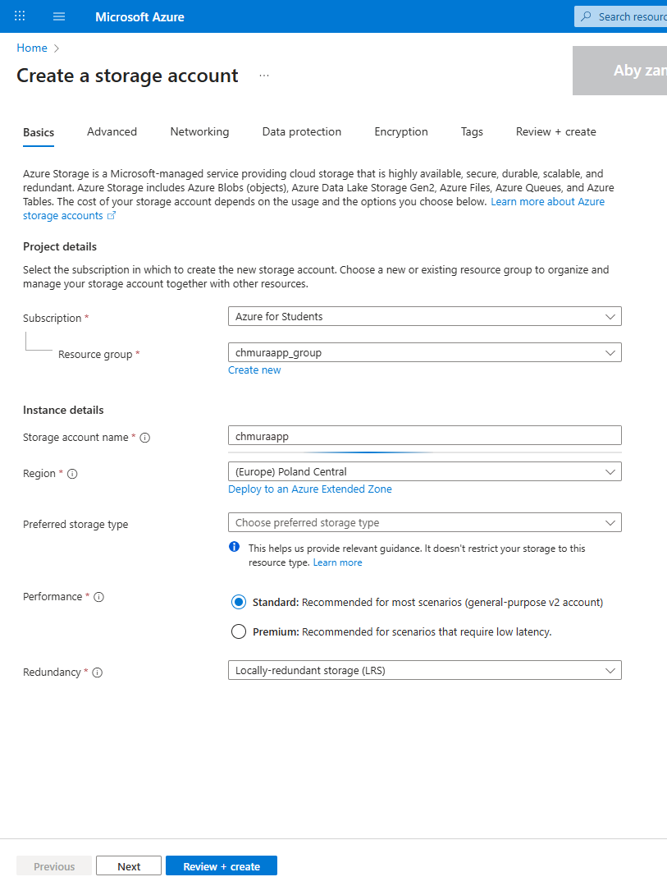
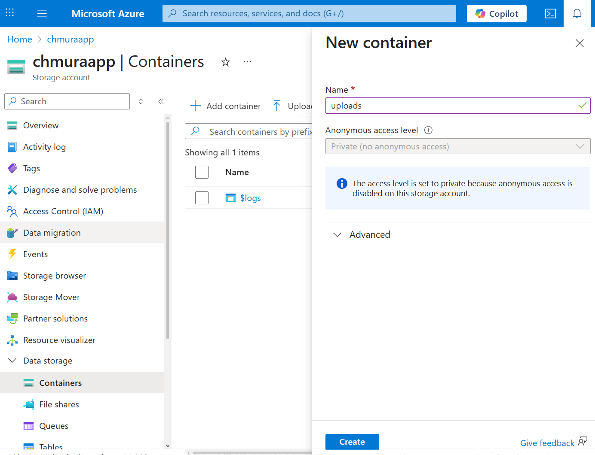
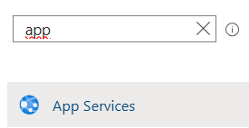
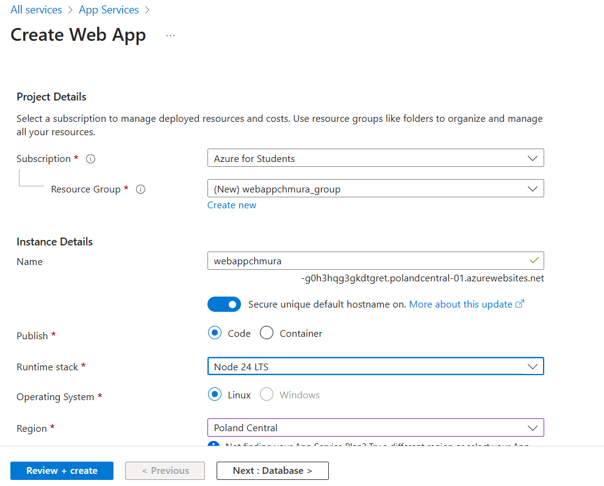
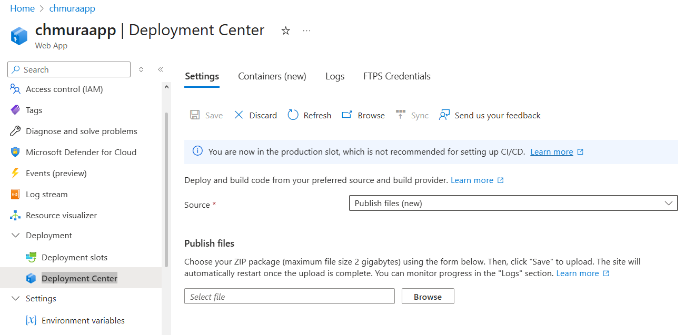

# Trójkamerowy System Fotopułapkowy Zintegrowany z Chmurą

Repozytorium:
[Kod źródłowy backend/mobile/embedded](https://github.com/Kasper123213/chmuraProjekt)

## Konfiguracja Azure Blob Storage

Po zalogowaniu się na konto studenckie:

1. **Utwórz Storage Account**
   - Przejdź do Azure Services → Storage accounts
   - Kliknij "Create"
   - Podaj nazwę, ustaw region na **Poland Central**
   - Kliknij "Review + create" → "Create"

   

   

2. **Dodaj Container**
   - Otwórz utworzony Storage Account
   - Przejdź do Data storage → Containers → Add container
   - Utwórz container o nazwie `uploads`

   

3. **Pobierz Connection String**
   - Przejdź do Security + Networking → Access keys
   - Skopiuj **Connection string**
   - Wklej do pliku `.env` jako `AZURE_STORAGE_CONNECTION_STRING`

## Konfiguracja .env

Utwórz plik `.env` w głównym katalogu projektu i uzupełnij następujące zmienne:

```env
AZURE_STORAGE_CONNECTION_STRING=<twoja-wartość>
GEMINI_API_KEY=<twoja-wartość>
OPENROUTER_API_KEY=<twoja-wartość>
UPLOAD_URL=http://localhost:3000/api/upload
```

**Opis zmiennych:**

- `GEMINI_API_KEY` - wygeneruj na [Google AI Studio](https://aistudio.google.com/u/1/api-keys)
- `OPENROUTER_API_KEY` - wygeneruj na [OpenRouter](https://openrouter.ai/google/gemini-flash-1.5)
- `UPLOAD_URL` - dla pracy lokalnej użyj `http://localhost:3000/api/upload`

> Klucz OPENROUTER umożliwia automatyczne przełączanie między modelami, gdy zabraknie tokenów GEMINI.

## Backend

### Wymagania

- **Python**: 3.14.0
- **Node**: 24.11.0
- **npm**: 11.6.1

### Uruchamianie lokalnie

1. Sprawdź, czy pierwsza linia pliku `server.js` zawiera:

   ```javascript
   require("dotenv").config();
   ```

2. Zainstaluj zależności:

   ```bash
   npm install
   ```

3. Uruchom projekt:
   ```bash
   npm start
   ```

Aplikacja będzie dostępna pod adresem: `http://localhost:3000`

### Wdrażanie na Azure

1. Sprawdź, czy pierwsza linia pliku `server.js` zawiera:

   ```javascript
   require("dotenv").config();
   ```

   Jeśli tak, usuń ją.

2. W Azure Services wybierz **App Services** → Create → Web App
   
3. Ustaw:
   - Nową lub istniejącą Resource Group
   - Nazwę aplikacji
   - Region: **Poland Central**
   - Runtime stack: **Node 24 LTS**
4. Kliknij "Review + create" → "Create"



5. W stworzonej aplikacji ustaw zmienne środowiskowe:
   - Settings → Environment variables → Add
   - Dodaj wszystkie zmienne z pliku `.env`

6. Wdróż projekt:
   - Utwórz archiwum ZIP zawierające: `package.json`, `package-lock.json`, `server.js`
   - Przejdź do Deployment → Deployment Center
   - Wybierz "Publish files"
   - Prześlij archiwum ZIP i kliknij "Save"

       

## Testy w Pythonie

### Przesyłanie plików

1. Utwórz środowisko wirtualne:

   ```bash
   python -m venv env
   env\Scripts\activate
   pip install -r requirements.txt
   ```

2. W folderze `images` umieść pliki: `1.jpeg`, `2.jpeg`, `3.jpeg`

3. Uruchom test przesyłania:
   ```bash
   python upload.py
   ```

### Pobieranie danych

Aby pobrać dane z Azure, uruchom:

```bash
python download.py
```

Pobrane pliki pojawią się w folderze `downloaded_images`

# Aplikacja mobilna

Krótki przewodnik z niezbędnymi informacjami dla osoby przejmującej repozytorium.

## 1. Co to jest

AzureBlobApp to aplikacja React Native obsługująca trójkamerowy system fotopułapkowy, korzystająca z natywnych modułów i kilku bibliotek (np. `@azure/storage-blob`). Punkt wejścia: [`index.js`](index.js), główny komponent: [`App.tsx`](App.tsx).

## 2. Wymagania

- Node.js 23.
- Java 17.
- npm lub yarn. Obecnie w projekcie npm
- Xcode (do iOS) — otwierać workspace (`ios/AzureBlobApp.xcworkspace`).
- Android Studio + SDK (do Android) — sprawdź konfigurację w [`android/app/build.gradle`](android/app/build.gradle).
- CocoaPods (iOS) — konfiguracja w [`ios/Podfile`](ios/Podfile).

## 3. Szybkie uruchomienie (dev)

1. Zainstaluj zależności JS:
   - npm: `npm install`
2. Uruchom aplikację na emulatorze lub podłączonym telefonie
   - `npx react-native run-ios` lub `npx react-native run-android`
   - alternatywnie:
3. Uruchom Metro:
   - npm: `npm start` lub użyj skryptu z [`package.json`](package.json) (`start`)
4. W drugim terminalu:
   - Android: `npm run android` / `yarn android` (skrypt: [`android` w package.json](package.json))
   - iOS: `npm run ios` / `yarn ios` (skrypt: [`ios` w package.json](package.json)) — lub otwórz Xcode i buduj z workspace (`ios/AzureBlobApp.xcworkspace/contents.xcworkspacedata`)

Przy problemach z budowaniem iOS sprawdź: [`ios/AzureBlobApp/Info.plist`](ios/AzureBlobApp/Info.plist) oraz ustawienia w [`ios/AzureBlobApp.xcodeproj/project.pbxproj`](ios/AzureBlobApp.xcodeproj/project.pbxproj).

## 4. Struktura projektu — najważniejsze pliki

- [`App.tsx`](App.tsx) — główny komponent aplikacji.
- [`index.js`](index.js) — rejestracja komponentu.
- [`package.json`](package.json) — skrypty i zależności.
- [`metro.config.js`](metro.config.js) — konfiguracja Metro (aliasy / polyfille).
- [`android/app/build.gradle`](android/app/build.gradle) — konfiguracja Android.
- [`ios/Podfile`](ios/Podfile) — konfiguracja CocoaPods.
- [`ios/AzureBlobApp.xcodeproj/project.pbxproj`](ios/AzureBlobApp.xcodeproj/project.pbxproj) — ustawienia Xcode projektu.
- [`src/PhotoGallery.tsx`](src/PhotoGallery.tsx) — główny komponent aplikacji odpowiadający za jej funkcjonalność.
- [`.eslintrc.js`](.eslintrc.js) — konfiguracja lintingu.

## 5. Testy i lint

- Nie są zaimplementowane ani UT ani SCA, ale w razie gdyby był na to plan to:
- Uruchom testy: `npm test` / `yarn test` (skrypt: [`test` w package.json](package.json)).
- Lint: `npm run lint` / `yarn lint` (konfiguracja: [`.eslintrc.js`](.eslintrc.js)).

## 6. Debugowanie i typowe problemy

- Metro cache: jeśli pojawiają się dziwne błędy JS -> `npx react-native start --reset-cache`.
- iOS: usuń DerivedData i ponownie `pod install`, otwórz workspace (`ios/AzureBlobApp.xcworkspace/contents.xcworkspacedata`).
- Android: sprawdź, czy keystore/debug (`android/app/debug.keystore`) jest poprawny, oraz ustawienia SDK w Android Studio (plik: [`android/app/build.gradle`](android/app/build.gradle)).
- Jeśli natywne codegen generuje błędy, sprawdź logi builda i skrypty w pods (`ios/build/generated`).

## 7. Wskazówki przy przejmowaniu projektu

- Sprawdź wersje Node / npm / CocoaPods używane przez autora.
- Przejrzyj konfigurację CI (jeśli istnieje poza repo) i zmienne środowiskowe.
- Zwróć uwagę na klucze i hasła — w repo powinny nie być (np. bundle id w [`ios/AzureBlobApp/Info.plist`](ios/AzureBlobApp/Info.plist) jest ustawiony na zmienne projektu).
- Jeśli chcesz zaktualizować React Native, przetestuj dokładnie natywne moduły i codegen.

## 8. Gdzie szukać dalszych informacji w repo

- Kod źródłowy komponentów UI: [`src/`](src/) (np. [`src/PhotoGallery.tsx`](src/PhotoGallery.tsx)).
- Konfiguracja Metro: [`metro.config.js`](metro.config.js).
- Konfiguracja natywna i build: katalogi `ios/` i `android/` (najważniejsze pliki: [`ios/Podfile`](ios/Podfile), [`android/app/build.gradle`](android/app/build.gradle), oraz [`ios/AzureBlobApp.xcodeproj/project.pbxproj`](ios/AzureBlobApp.xcodeproj/project.pbxproj)).
